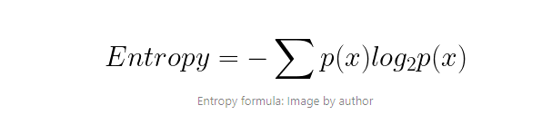
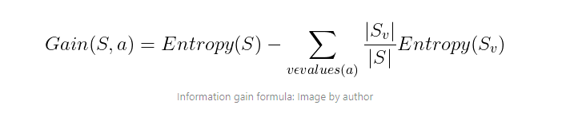
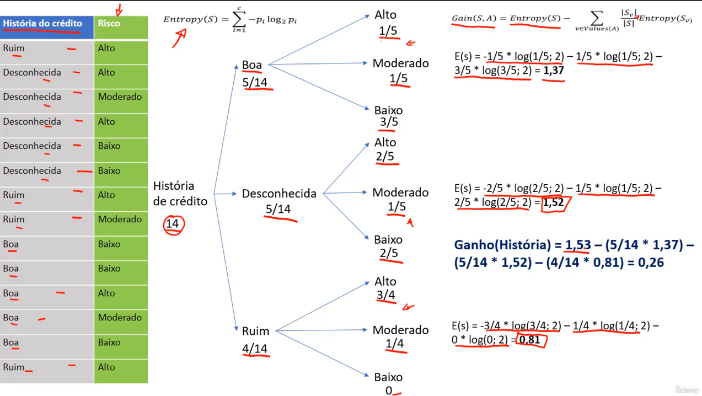
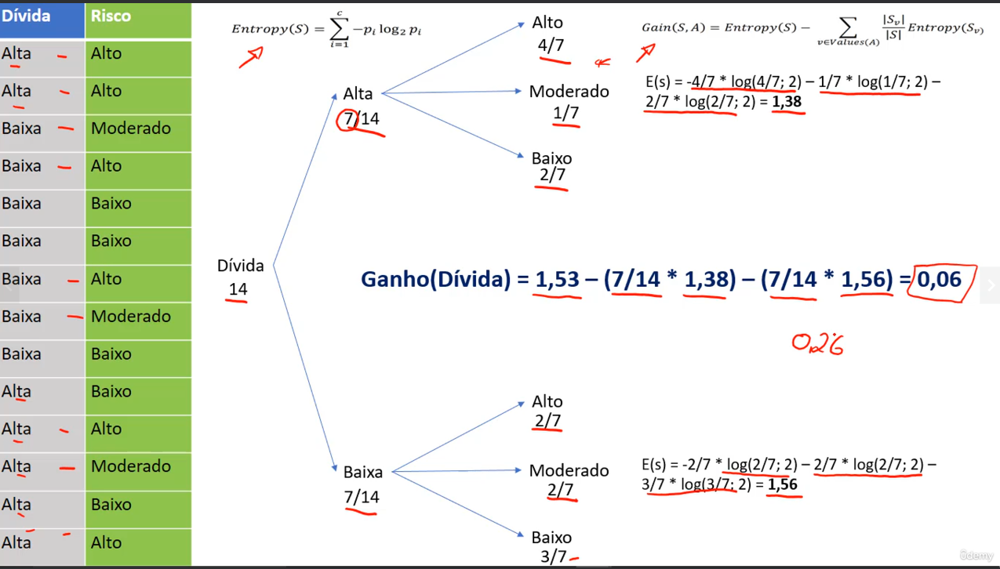
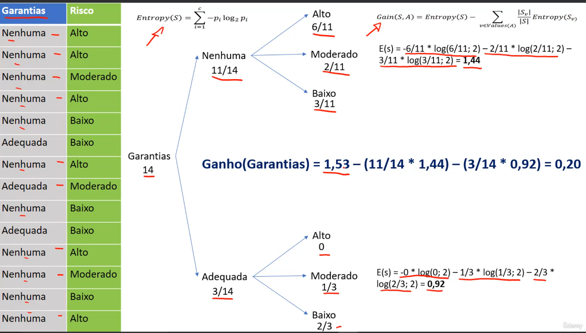
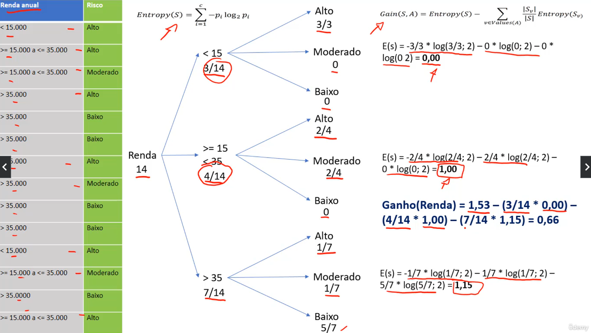
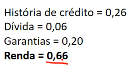
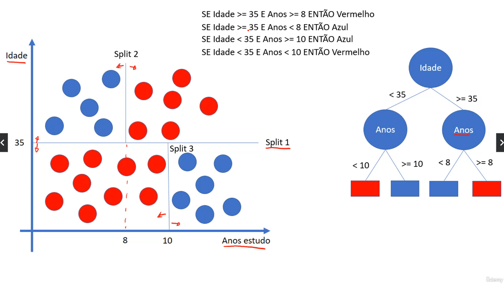

# Árvore de decisão 

## Introdução

Árvores de decisão são modelos de aprendizado de máquina que utilizam uma estrutura de árvore para representar regras de decisão e possíveis resultados. Elas são amplamente utilizadas em problemas de classificação e regressão, sendo uma das técnicas mais populares em aprendizado supervisionado. Ela pega dados históricos e os divide em subconjuntos cada vez menores, até que cada subconjunto contenha apenas uma classe ou valor de saída. 

Os átributos que estão no topo da árvore são os mais importantes para a classificação, enquanto os que estão na base são os menos importantes. A árvore é construída de forma a minimizar a impureza dos subconjuntos, ou seja, a incerteza sobre a classe dos dados.

Cálculo da Arvore de Decisão

Primeiro é feito a entropia do conjunto de dados, que é a medida da incerteza dos dados. A entropia é calculada pela fórmula:

E após isso é feito o cálculo do ganho de informação, que é a diferença entre a entropia do conjunto de dados e a entropia dos subconjuntos. O ganho de informação é calculado pela fórmula:

Exemplo do cálculo

Agora aplicando o ganho de informação para cada atributo:

Ganho de informação para o atributo Historia de credito

Ganho de informação para o atributo Divida

Ganhos de informação para o atributo garantia

Ganho de informação para o atributo Renda Anual:

Tabela de ganho de informação:

Logo, com a Renda tendo maior valor de ganho de informação conforme os cálculos feitos, ela será a raiz da nossa árvore. E para os nós seguintes deve ser feito novamente um novo ciclo de cálculos de entropia e de ganho de informação, logo, a arvore de decisão é um algoritmo recursivo.

Uma outra maneira de representar as árvores de decisão é através de um gráfico com vários splits, onde cada nó representa uma decisão e cada ramo representa um resultado possível. A árvore é construída de forma a minimizar a impureza dos subconjuntos, ou seja, a incerteza sobre a classe dos dados.

## Poda em Árvores de Decisão

Poda é um processo que visa reduzir o tamanho da árvore de decisão, removendo ramos que não são úteis. Isso é feito para evitar overfitting, que é o ajuste excessivo do modelo aos dados de treinamento, o que pode prejudicar a generalização do modelo para novos dados. A poda pode ser feita de duas formas: pré-poda e pós-poda.

Bias(viés): É a diferença entre a previsão do modelo e o valor real. Um modelo com alto bias não consegue capturar a complexidade dos dados, enquanto um modelo com baixo bias consegue capturar a complexidade dos dados.

Variância: É a sensibilidade do modelo a pequenas variações nos dados de treinamento. Um modelo com alta variância é muito sensível aos dados de treinamento, o que pode levar a overfitting. Um modelo com baixa variância é mais robusto e generaliza melhor para novos dados.

## Vantagens e Desvantagens

Vantagens:

- Fácil de entender e interpretar
- Não precisa de normalização ou padronização dos dados
- Rápido para classificar novos registros

Desvantagens:

- Tendência ao overfitting
- Pequenas mudanças nos dados podem levar a grandes mudanças na árvore (poda pode ajudar a resolver isso)

Existem alguns upgrades no algoritmo de árvore de decisão, como o Random Forest e o Gradient Boosting, que são técnicas mais avançadas e que podem melhorar a performance do modelo.
