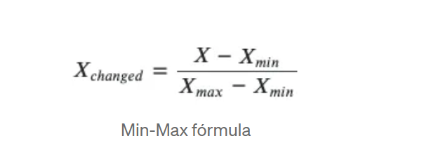
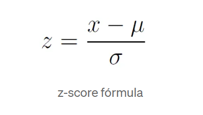

# Escalonamento de Atributos

O escalonamento de atributos é uma técnica crucial de pré-processamento de dados em aprendizado de máquina. Ele visa normalizar os dados para que todos os atributos estejam na mesma escala. Isso é importante porque muitos algoritmos de aprendizado de máquina são sensíveis à escala dos atributos, o que pode afetar o desempenho do modelo, tornando-o enviesado em favor dos atributos com maior escala.

Existem várias técnicas de escalonamento de atributos, sendo as mais comuns a **normalização** e a **padronização**.

## Normalização (Normalization)

A normalização transforma os valores dos atributos para um intervalo específico, geralmente entre 0 e 1. Essa técnica é útil quando se deseja manter a proporcionalidade dos dados e evitar que atributos com maiores valores dominem o treinamento do modelo.

A fórmula para normalização é:



## Padronização (Standardization)

A padronização transforma os valores dos atributos de modo que tenham uma média de zero e um desvio padrão de um. Isso é particularmente útil quando os dados têm outliers, pois a padronização reduz o impacto que esses pontos extremos podem ter no treinamento do modelo.

A fórmula para padronização é:



## Quando Usar Normalização ou Padronização?

A escolha entre normalização e padronização depende do algoritmo de aprendizado de máquina que será utilizado:

- **Normalização:** Indicada para algoritmos que não assumem nenhuma distribuição dos dados, como redes neurais e algoritmos baseados em distâncias (ex.: K-Nearest Neighbors).
- **Padronização:** Preferida quando os dados possuem outliers significativos ou quando se utiliza algoritmos que assumem uma distribuição normal dos dados, como regressão linear ou SVM (Support Vector Machines).

**Dica:** A padronização é geralmente recomendada como técnica padrão, especialmente se houver a presença de outliers na base de dados. No entanto, sempre vale a pena testar ambas as abordagens para identificar qual proporciona os melhores resultados para o problema em questão.

## Aplicação Prática

Com o avanço das bibliotecas de aprendizado de máquina, como o Scikit-learn, a aplicação de escalonamento de atributos se tornou muito simples. Para padronização, pode-se utilizar a classe `StandardScaler`, enquanto para normalização, a classe `MinMaxScaler` é a mais adequada.

**Exemplo em Python:**

```python
from sklearn.preprocessing import StandardScaler, MinMaxScaler

# Para padronização
scaler = StandardScaler()
dados_padronizados = scaler.fit_transform(dados)

# Para normalização
scaler = MinMaxScaler()
dados_normalizados = scaler.fit_transform(dados)
